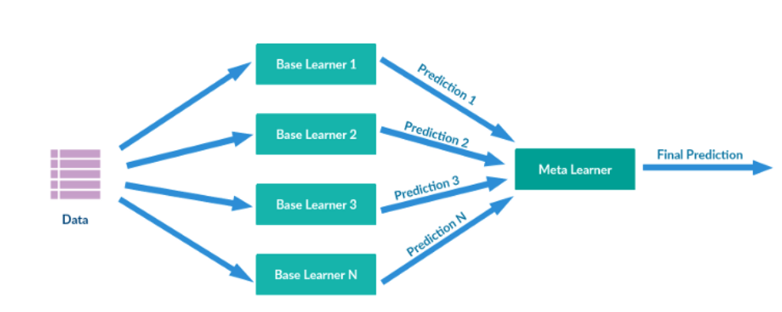

# Ensembles

實用連結：

1. [Ensemble Learning—Bagging and Boosting](https://becominghuman.ai/ensemble-learning-bagging-and-boosting-d20f38be9b1e)

2. [Boosting, Bagging, and Stacking—Ensemble Methods with sklearn and mlens](https://medium.com/@rrfd/boosting-bagging-and-stacking-ensemble-methods-with-sklearn-and-mlens-a455c0c982de)

3. [機器學習: Ensemble learning之Bagging、Boosting和AdaBoost](https://medium.com/@chih.sheng.huang821/機器學習-ensemble-learning之bagging-boosting和adaboost-af031229ebc3)

<div style="color:tomato;">這跟非監督式學習還有關係嗎？</div>

Ensembles中文稱作**集成學習**，意思是想辦法將多個預測模型合起來，然後預測效果（或分類）的表現可以勝過單一個模型。

一個比較傳神的比喻是：

- 每一個個別的機器學習模型都像是盲人摸象故事裡的盲人

- 若能將盲人（個別模型）所看到的結果綜合起來，我就可以得知大象是長怎麼樣子（有良好的預測或分類表現）

常見的手法即有以下三種：Bagging/Boosting/Stacking

### Bagging{-}

Bagging基本上就是Bootstrap aggregation。我透過不斷重新抽樣本並丟入模型（我們可以有多個模型同時做訓練），透過反覆重抽，我可以觀察到資料本身的bias(the mean) & variance(the standard deviation)

最終取所有模型的預測表現之平均。藉此可以在不影響偏誤（bias）下，降低我預測結果的變異程度（variance）。

至少我不會一次丟到靶心，下一次卻什麼也沒射中。


### Boosting{-}

是一種多模型的接力使用。

我會刻意放大A模型預測錯誤的地方之權重，並且做為接續之B模型的訓練重點。

#### R Code Example{-}

```{r}
#The following object is masked from ‘package:dplyr’:slice
#be aware the same slice function from two different package
    
library(xgboost)
modelLookup("xgbLinear")
modelLookup("xgbTree")
```

```{r}
xgb_opts = expand.grid(eta=c(.3,.4),
                       max_depth=c(9, 12),
                       colsample_bytree=c(.6,.8),
                       subsample=c(.5,.75,1),
                       nrounds=1000,
                       min_child_weight=1,
                       gamma=0)
```

```{r}
set.seed(1234)
#the R code form m-clark has the object called 'good'. Be aware the variable name is different or not, and the technique are all the same
results_xgb = train(quality~.,  
                    data=wine_train, 
                    method='xgbTree',
                    preProcess=c('center', 'scale'), 
                    trControl=cv_opts, 
                    tuneGrid=xgb_opts)
results_xgb
preds_gb = predict(results_xgb, wine_test)
confusionMatrix(preds_gb, good_observed, positive='Good')
```

### Stacking{-}


在stacking裡面，重要的是那些單一預測模型，都是最終meta-learner模型所需的訓練資料的來源。

> 一般來說，若我們手上已經嘗試過多個單一預測模型，則我可以選擇像bagging一樣，將表現平均（voting），一般平均或者加權平均都沒問題。

首先我利用不同的單一模型做訓練，並且將資料餵入並得到每一個模型下的y_i_hat，並且將這些y_i_hat，用為meta_learner model的資料來源。

等到meta_learner選定好之後，並用原始資料以及y_i_hat的資料一起去訓練meta_learner模型。

stacking的感覺其實有一點像NNet，把中間加了一層，但是不代表越多層準確度就越好。


